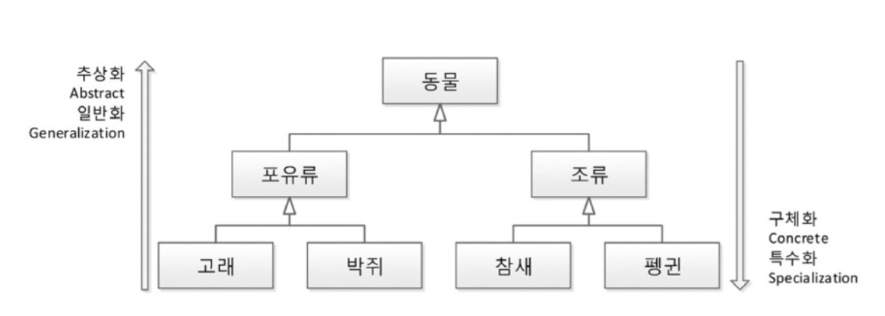
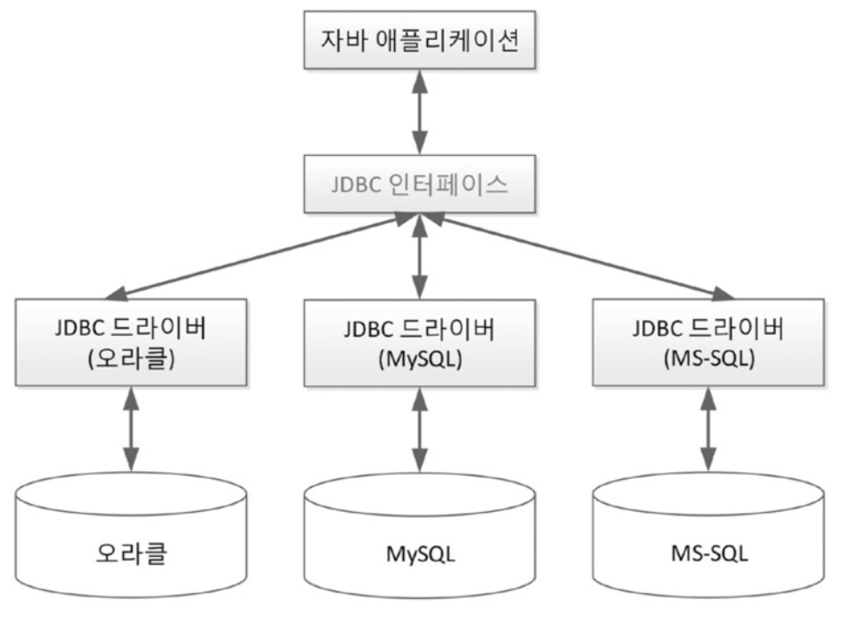

# 객체지향

한글로 자바코드를 나타낸다면
`클래스 객체명 = new 클래스();` 이다. 

아주 유우우명한 잘못된 비유 `클래스와 객체의 관계는 붕어빵틀과 붕어빵이다.`를 이 코드로 나타내보면
```java
붕어빵틀 붕어빵 = new 붕어빵틀();
```

굉장히 어색한 표현이다. 붕어빵은 붕어빵틀이 아닙니다. 
좀 더 올바르게 표현을 해보면 
```java
클래스 객체참조변수 = new 클래스();
금형틀 붕어빵틀 = new 금형틀();
```
이 좀 더 정확한 표현인 것같다.
즉, 붕어빵틀은 붕어빵을 만드는 '팩터리'였던 것인데 자세한 것은 팩터리 패턴을 찾아보자.

한 문장으로 요약하면
클래스는 분류에 대한 개념이지 실체가 아닙니다. 객체는 실체입니다.
사람이라는 클래스가 있고 '우렁리'라는 구체적인 객체가 있는 것입니다. 
```java
사람 우렁리 = new 사람();
```

사람(클래스) 에게는 나이를 물어볼 수 없지만 우렁리(객체 참조 변수)에게는 나이를 물어볼 수 있습니다.

- 객체는 유일무이한(unique)한 사물이다.
- 클래스는 같은 특성을 지닌 여러 객체를 총칭하는 집합의 개념이다.
- 
## 객체지향의 4대특성
### 캡슐화: 정보은닉

### 상속: 재사용 + 확장
객체지향에서의 상속은 상위 클래스의 특성을 하위클래스에서 상속하고 거기에 더해 필요한 특성을 추가, 즉 확장해서 사용할 수 있다는 의미입니다. 따라서, 확장, 세분화, 슈퍼클래스-서브클래스 의 개념으로 이해하는 것이 더 좋습니다.

상위클래스로 갈수록 추상화, 일반화 되어있고, 하위클래스로 갈수록 구체화, 특수화 됐다고 생각하면 됩니다.

이 말은 객체지향 5원칙 가운데 LSP(리스코프 치환 원칙)을 나타내는 말이기도 합니다.

- 객체지향의 상속은 상위클래스의 특성을 재사용하는 것이다.
- 객체지향의 상속은 상위클래스의 특성을 확장하는 것이다.
- 객체지향의 상속은 is a kinf of 관계를 만족해야하한다. ex) 고래 is a kind of 동물

상위 클래스는 하위클래스에게 특성(속성과 메서드)을 상속해주고, 인터페이스는 클래스가 '무엇을 할 수 있다'라고 하는 기능을 구현하도록 강제하게 된다.

생각해볼 질문) 
- 상위 클래스는 하위클래스에게 물려줄 특성이 많을수록 좋을까? 적을수록 좋을까?
- 인터페이스는 구현을 강제할 메서드가 많을수록 좋을까? 적을수록 좋을까?
### 추상화
추상화란 구체적인 것을 분해해서 관찰자가 관심있는 특성만 가지고 재조합하는 것이라고 정리 할 수 있습니다. 
모델링은 목적에 맞는 관심 있는 특성만 추출해서 표현하는 것입니다. 이는 객체지향 설계 뿐만 아니라 데이터베이스의 테이블을 설계할 때도 중요합니다.

### 다형성: 사용편의성
**오버라이딩IOverriding)**
같은 메서드 이름, 같은 인자 목록으로 상위 클래스의 메서드를 재정의

**오버로딩(Overloading)**
같은 메서드 이름, 다른 인자 목록으로 다수의 메서드를 중복 정의

~~상위 클래스 타입의 객체 참조 변수를 사용하더라도 하위 클래스에서 오버라이딩한 메서드가 호출됩니다.~~

# 객체지향 설계 5원칙 - SOLID
앞서 말한 객체지향 4대 특성은 도구라고 생각하면 됩니다. 
비유하자면, 객체지향의 4대특성은 요리를 만들기 위한 불, 물, 칼 등 요리 도구라고 할 수 있습니다.
이러한 객체지향의 특성을 올바르게 사용하기 위한 설계 원칙이 객체지향 설계 5원칙 이라고 합니다.

- SRP(Single Responsibility Principle): 단일 책임 원칙
- OCP(Open Closed Principle): 개방 폐쇄 원칙
- LSP(Liskov Subsitution Principle): 리스코프 치환 원칙
- ISP(Interface Segregation Principle): 인터페이스 분리 원칙
- DIP(Dependency) Inversion Principle): 의존 역전 원칙

이 원칙들은 응집도는 높이고, 결합도는 낮추는 고전 원칙을 객체지향의 관점에서 재정립한 것이라 할 수 있습니다.

*이 원칙들은 보는 사람의 관점에 따라 다르게 해석될 수 있습니다.

## SRP(Single Responsibility Principle): 단일 책임 원칙

`어떤 클래스를 변경해야 하는 이유는 오직 하나 뿐이다.`

SRP를 이해하기 위해 단일 책임을 지키지 못하는 경우를 살펴보겠습니다. 
```java
class 음료 {
    final static int 뜨거움 = 1;
    final static int 차가움 = 0;
    int 온도;
    
    void 마시다() {
        if (this.온도 == 뜨거움) {
            // 호호 불면서 마신다
        } else {
            // 쭉 마신다
        }
    }
}
```
이렇게 단일 책임을 적용해 리팩터링 하면 아래 코드처럼 작성해 볼 수 있겠습니다.

```java
abstract class 음료 {
    abstract void 마시다();
}

class 차가운음료 extends 음료 {
    void 마시다() {
        // 쭉 마신다.
    }
}

class 뜨거운음료 extends 음료 {
    void 마시다() {
        // 호호 불면서 마신다.
    }
}
```

이렇듯 단일 책임 원칙은 앞서 말한 4대특성 중 추상화와 가장 밀접한 관계를 가지고 있다.
## OCP(Open Closed Principle): 개방 폐쇄 원칙

`자신의 확장에는 열려있고 주변의 변화에 대해서는 닫혀있어야 한다.`

JDBC의 예를 들어보면 JDBC를 사용하는 클라이언트는 데이터베이스가 오라클에서 MySQL로 바뀌더라도 Connection을 설정하는 부분 외에는 따로 수정할 필요가 없습니다. Connection 설정 부분을 별도의 파일로 분리해두면 클라이언트 코드는 단 한 줄도 변경할 필요가 없습니다.

자바의 예시로 봐도 자바는 한 운영체제에서 작성한 소스코드가 JVM이 있는 다른 운영체제에서도 실행됩니다. 즉, 개발자가 작성한 소스코드는 운영체제의 변화에 닫혀 있고, 각 운영체제별 JVM은 확장에 열려 있는 구조가 되는 것입니다.
## LSP(Liskov Subsitution Principle): 리스코프 치환 원칙

`서브 타입은 언제나 자신의 기반 타입으로 교체할 수 있어야 한다.`
## ISP(Interface Segregation Principle): 인터페이스 분리 원칙

`클라이언트는 자신이 사용하지 않는 메서드에 의존 관계를 맺으면 안된다.`
## DIP(Dependency) Inversion Principle): 의존 역전 원칙

`자신보다 변하기 쉬운 것에 의존하지 마라. `

---

SOLID 원칙을 적용하면 소스 파일의 개수는 더 많아지는 경향이 있습니다. 하지만 이렇게 많아진 파일이 논리를 더욱 잘 분할하고, 잘 표현해서 이해하기 쉽고, 개발하기 쉬우며, 유지와 관리, 보수하기 쉬운 소스가 만들어집니다.